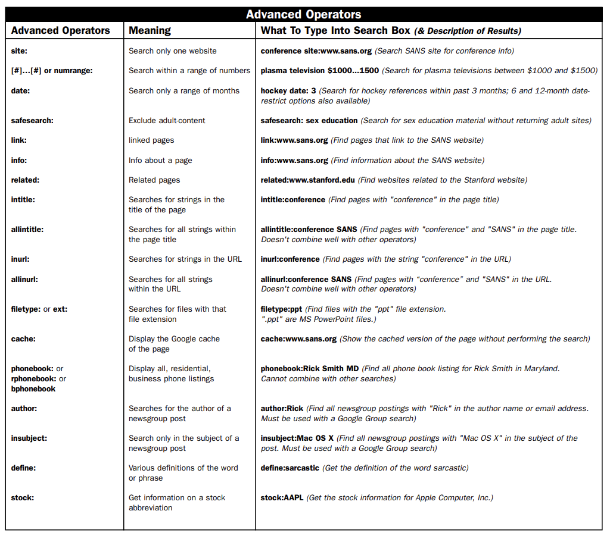
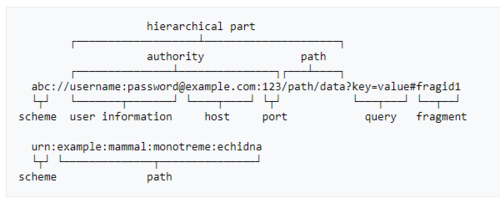
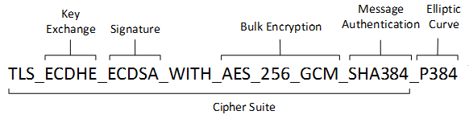

# Section 4 : Passive Recon

- Recon is the first step in performing an adversarial attack on the victim.

- Recon helps us in the enumeration phase where we sift through the information for possible attack vectors and vulnerabilities to engage with

#### This section will only deal with passive recon 

>Passive Recon can be defined as:
> - Perform Recon without victims alerts being triggered
> - Compile Recon with with publicly available information

## Actionable Info:

> Network Info
> - IP Addresses
> - Domains and Sub domains
> - Server Types
> - Ports
> - DNS
> - Cipher Suites


> Tech Stack
> - Server language
> - Cloud Providers
> - Firewalls
> - Communication Channels
> - Deployment and Development Tools
> - Infra Management Tools


> Employees
> - Hierarchy
> - Emails
> - Department Structure
> - Office Locations
> - Social Behaviors
> - Access and Roles

## Recon Sources
> Trash / Dumpster Diving
> - Old access cards
> - Shredded Docs
> - Password and Sticky Notes
 
> Social Media Scraping
> - Employee Behavior
> - Employee Posts and Interests
> - Employee Social Circle and Hierarchy


> Employee Blogs, LinkedIn and Landing Pages
> - Tech stacks
> - Office Locations
> - cloud platforms and infra
> - other tools (Slack,Jira,Teams)

> Public Repos
> - Libs used
> - Frameworks used
> - Coding Standards
> - Vulns in repo

> Companies Main Site and Investor Portals
> - Keynotes
> - Mergers
> - Future Plans


> Job Hiring Descriptions
> - Tech Stack 
> - Hiring Patterns 


> CWE and CVE
> - Common Vuln Enumeration : Knowledge base of specific vuln instances
> ex : Microsoft Registry Vuln
> list : CISA
> - Common Weakness Enumeration : Knowledge base of weakness's that can become vuln
> ex : log4j weakness in multiple apps
> list : NIST

> Google Dorking
> - Hidden Files
> - sub domains
> - website vulnerabilities

> Passive Recon Tools
        - To be discussed further

<br>
- While Passive Recon Tools are the main focus the other aforementioned Sources can be really valuable. It is important to confirm the permission that these sources can be pursued by the client before engaging in them.

## Passive Recon Tools

- Passive Recon Tools are a set of tools that automate the info gathering process.
- These tools not only just scrape target info but also help manage data, visualize info, and share info to publicly available knowledge bases.
- We will be discussing theses tools in this section
<br>

>  OSINT tools
> a set of open source intelligence tools that are efficient in performing passive recon with openly available data about target on the internet.|

## Tool List

|Name|Description|Info Type|
|-|-|-|
| Harvester | gather network data of given domain | email, subdomain, hosts, employees|
| Metagoofil | Extract Metadata associated with files on target websites. | Emails, Usernames, Servers, Paths |
| Foca | Same as Metagoofil, windows only, Ui based | Emails, Usernames, Servers, Paths |
| Censys | Search Engine to collect info about hosts and networks | Host IPs, Ports, Protocols, etc|
| Shodan | Search Engine that searches Systems and IOT on the internet | Wide range of info including ports, ssls, dns, ips, protocols, devices, servers |
| Maltego | Streamlines Info Gathering and Helps Visualize gathered info (red threading) | Employee Info, Network Info , Threat Info |
| OSINT.com | A website with framework of tools to gather required info by pointing to specialized tool | - |
| ReconNg | A framework shell that allows to install various data gathering modules and manage collected data into a DB | Emails, Domains, IPs, Servers, etc |

<br>
- the following tools are nowhere close to an exhaustive list as new vulnerabilities, attack vectors and threats are detected everyday.
- however familiarizing yourself with a general purpose tool like maletgo / shodan / recon-ng and using OSINT to fill in niche gaps in info is a viable strat
<br>

## Google Dorking

- also called as google hacking, power user and GHDB.
- its one of the simplest and easiest way to gather info about the target

### Search filters



### Search Operators

#### Specific Search Term 

- This operator searches for the exact phrase within speech marks only. 

```
"Tinned Sandwiches"
```

#### Synonyms

- Adding a tilde to a search word tells Google that you want it to bring back synonyms for the term as well.

```
~set
```
#### OR

```
site:facebook.com | site:twitter.com
```

#### AND

```
site:facebook.com & site:twitter.com
```

#### Include and Exclude results

```
site:facebook.* -site:facebook.com +site:facebook.co.in
```

#### Glob pattern (*)

```
site:*.com
```

## How to use gathered Info

- DNS Information 
  - a lot of attack vectors can become clear by gaining info about the DNS
  - MITM attacks, Phishing Campaigns and DNS Dos attacks are a few examples.
  - they also provide info about which subdomain routes to which IP
  - Types of records:
    - A : ipv4
    - AAAA : ipv6
    - MX : mail
    - NS : name seerver
    - CNAME : domain -> domain/subdomain
    - PTR : reverse of A
    - SOA : zone info
<br>

- IPs and ports : server comm entrances. used to spam with DOS, gain access via phishing, establish C2.
<br>

- User Info : the weakest link always is the employee
  - Email : phishing campaign
  - Passwords : crack by compiling user profiles, leaked via reused password or sticky note
  - Phone : monitoring , 2fa breach
  - Social Behavior : Stalking, Steal Access Card, Steal Biometrics 
<br>

- URL syntax : 
  - helps locate vuln in website routing and browser scripts
  - methods : diff call types (GET/POST/PUT/DELETE)
  - response code : response to method calls (1xx,2xx,3xx,4xx,5xx)
  - percent encoding : encrypt the url syntax, 8 bit encoding and send non-safe characters in url
  - 
<br>

- Cipher Suites :
  - each website bargains what encryptions to use when establishing connection.
  - cipher suites are usually strict but try to maintain a priority list to increase number of devices that are connectible
  - protocols like ssl2.0/ssl3.0/ tls have their own cipher suite config 
  - SSL is now insecure
  - 
<br>

- CERTs :
  - Certificates are needed by certs to prove authenticity while establishing secure and private channel
  - expired certs/certless site can mean attacker can mimic the site and read user info or cert encryption has vuln
  - Cert types : 
    - SSL
    - TLS
    - Wildcat - covers all subdomains
    - SAN - diff domain same cert (linkedin.com and linked.in)
  - CRL  - Certificate Revocation list - used to authenticate cert validity (site cert -> CA cert -> Root Cert (self signed) )
  - OCSP - Online Certificate Status Protocol - used to authenticate cert validity
  - CRL sends entire list where as OCSP checks cert on OCSP server  (Cert Pinning vs CERT stapling)
- HTTP Strict Transport Security (HSTS) is a simple and widely supported standard to protect visitors by ensuring that their browsers always connect to a website over HTTPS.
